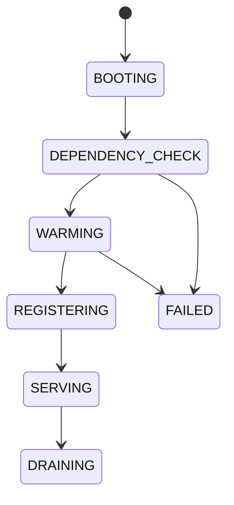
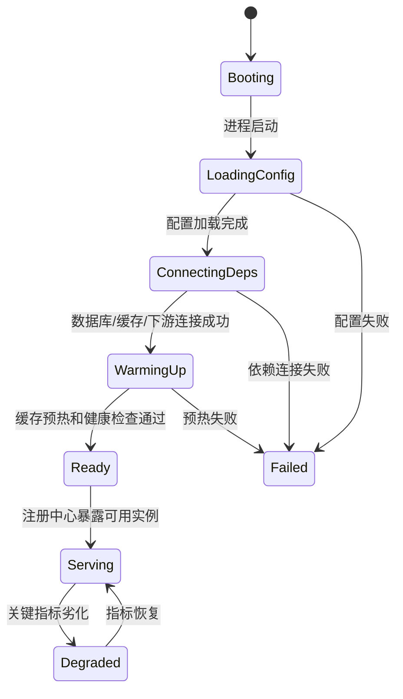

# 14 优雅启动：如何避免流量打到没有启动完成的节点

进程启动成功，不代表服务已经准备好接收 RPC 流量。类加载完成、端口监听成功、健康检查通过、缓存预热完成、连接池建立、配置加载、下游依赖可用，这些条件之间有明显差别。

优雅启动要解决的，就是不要让一个“刚能喘气”的实例立刻承担真实业务流量。

## 本章要解决的问题

生产环境里，新实例启动后的前几十秒经常是事故高发期：

- 本地缓存还没加载完成，请求命中数据库，导致 DB QPS 抖升。
- JIT 尚未热身，首批请求延迟明显高于稳定期。
- 连接池还没建好，首批调用大量阻塞在建连上。
- 配置中心、证书、规则、限流参数尚未拉取成功。
- 实例刚注册，负载均衡立即按正常权重打满流量。

优雅启动的目标是：启动期间先自检、再预热、再注册、再逐步放量。

## 核心观点

- 服务启动是阶段性过程，不能用“端口可监听”代表“业务可用”。
- 注册中心里的可见状态必须晚于业务准备完成。
- 新节点需要预热权重，避免瞬间承接和老节点一样的流量。
- 启动检查要覆盖关键依赖，但不能把非关键依赖变成启动阻塞点。
- 启动过程也需要超时和失败策略，不能无限卡在半启动状态。

## 原理拆解

一个完整的启动状态机可以设计为：



这里最关键的是 `SERVING` 状态。只有进入 `SERVING` 后，服务才应该出现在注册中心的可用实例列表里，或者让 Kubernetes readinessProbe 返回成功。

启动过程通常包含以下检查：

```text
必需项：
- 配置中心加载成功
- 注册中心连接正常
- RPC 端口监听成功
- 线程池初始化完成
- 证书和密钥加载成功
- 核心下游依赖可访问

建议项：
- 本地缓存预热
- 热点数据加载
- 连接池最小连接建立
- Sentinel / 熔断 / 限流规则加载
- OpenTelemetry exporter 初始化
```

但也要避免检查过度。例如评论服务启动时，推荐服务不可用不一定应该阻止评论服务接流量。启动依赖要分级：强依赖失败则不注册，弱依赖失败则降级运行并暴露告警。

## 工程实践

在 Kubernetes 中，`startupProbe`、`readinessProbe` 和应用内部状态要一起设计。

```yaml
readinessProbe:
  httpGet:
    path: /ready
    port: 8080
  periodSeconds: 3
  failureThreshold: 2
startupProbe:
  httpGet:
    path: /startup
    port: 8080
  periodSeconds: 5
  failureThreshold: 24
```

`startupProbe` 给慢启动服务更长的初始化时间，避免被 liveness 过早杀死；`readinessProbe` 表示是否可以接收业务流量。

RPC 框架可以在服务注册时设置启动权重：

```yaml
rpc:
  provider:
    registerAfterReady: true
    warmup:
      enabled: true
      durationSeconds: 120
      minWeight: 10
      maxWeight: 100
```

负载均衡器按照启动时间计算动态权重：

```java
int warmupWeight(Instance ins, int baseWeight) {
    long uptimeMs = now() - ins.startTimeMs();
    long warmupMs = ins.warmupDurationMs();
    if (uptimeMs >= warmupMs) {
        return baseWeight;
    }
    return Math.max(1, (int) (baseWeight * uptimeMs / warmupMs));
}
```

对于缓存预热，可以采用“同步加载底线数据 + 异步加载热点数据”的策略。启动路径只阻塞必须数据，热点缓存通过后台任务逐步填充，期间配合本地限流保护数据库。

启动 checklist：

- 端口监听成功是否等于 readiness 成功？如果是，需要拆开。
- 核心依赖和弱依赖是否区分？
- 注册中心是否在应用 ready 后才注册？
- 新实例是否有权重预热？
- 启动失败是否能快速暴露，而不是假健康？
- 预热失败时是阻塞启动、降级运行，还是自动回滚？

### 补充图示：从启动到接流的状态机



优雅启动的关键原则是：只有进入 `Ready` 后才允许注册或放量，进程存活不等于业务可用。

## 常见坑

- 应用一启动就注册服务，缓存和连接池还没准备好就被打满。
- readiness 只检查 HTTP 端口，无法代表 RPC 处理能力。
- 所有依赖都作为强依赖，导致一个非核心系统失败时主服务无法启动。
- 新节点没有预热，被负载均衡直接分配正常权重。
- 启动检查没有超时，容器一直处于不确定状态。
- 预热逻辑把数据库打爆，启动过程本身变成故障源。

## 面试追问

1. 为什么服务端口监听成功不等于服务可用？
2. startupProbe 和 readinessProbe 有什么区别？
3. 服务启动时应该先注册还是先预热？
4. 如何设计新实例的预热权重？
5. 启动检查中的强依赖和弱依赖如何划分？
6. 缓存预热失败时应该阻止服务启动吗？

## 小结

优雅启动的本质是控制新实例进入流量池的节奏。它把服务启动从一个瞬间动作，拆成了准备、校验、预热、注册和放量几个阶段。

服务治理里有一句很实在的话：不要相信“进程活着”，要相信“它已经准备好承担业务后果”。
