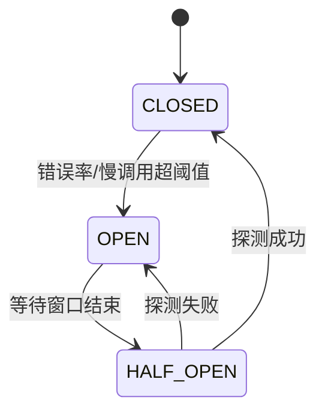
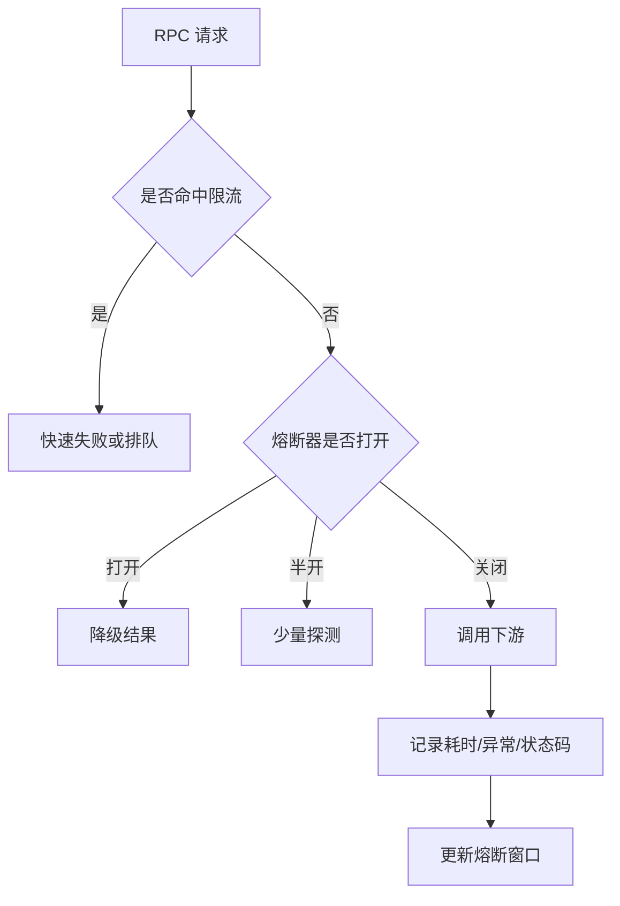

# 15 熔断限流：业务如何实现自我保护

在分布式系统里，故障很少停在原地。一个下游变慢，可能拖住上游线程池；上游线程池耗尽，又会影响更多入口请求；入口请求堆积后，用户继续刷新，流量进一步变大。最后真正压垮系统的，可能不是最初那个故障，而是系统没有及时自我保护。

熔断和限流就是 RPC 治理里的“止损机制”。

## 本章要解决的问题

本章关注的是：当下游异常、流量突增、依赖延迟升高或错误率持续上升时，调用方如何快速降低损失，保护自身线程、连接、CPU、内存和关键业务链路。

限流解决“流量太多”的问题，熔断解决“依赖不可靠”的问题，降级解决“失败后给用户什么结果”的问题。三者经常一起出现，但边界不能混淆。

## 核心观点

- 限流是入口控制，熔断是依赖保护，降级是结果兜底。
- 熔断判断不能只看错误率，还要结合慢调用比例、请求量基线和时间窗口。
- 限流策略要区分接口优先级，不能让低价值流量挤掉核心交易。
- 熔断后要半开探测，不能永久拒绝。
- 保护策略必须可观测、可动态调整，并能在事故中快速生效。

## 原理拆解

熔断器通常有三种状态：



`CLOSED` 表示正常调用；`OPEN` 表示直接拒绝或走降级；`HALF_OPEN` 表示放少量探测请求判断依赖是否恢复。

限流常见算法包括固定窗口、滑动窗口、令牌桶和漏桶。RPC 场景中，令牌桶适合允许一定突发，漏桶适合稳定匀速下游，滑动窗口适合统计类规则。



生产中要特别关注慢调用。很多事故早期不是错误率升高，而是 P99 延迟先被拉长。如果只在失败后熔断，系统已经堆积了大量等待线程。

## 工程实践

Sentinel 可以从资源维度配置 QPS、并发数、慢调用比例、异常比例等规则。resilience4j 则提供 CircuitBreaker、RateLimiter、Bulkhead、TimeLimiter 等组合能力。

一个面向 RPC 方法的配置示例：

```yaml
rpc:
  governance:
    resources:
      InventoryService.deduct:
        timeoutMs: 300
        rateLimit:
          qps: 800
          burst: 100
        circuitBreaker:
          slidingWindowSize: 100
          minimumNumberOfCalls: 50
          failureRateThreshold: 40
          slowCallRateThreshold: 60
          slowCallDurationMs: 250
          openStateWaitMs: 5000
          halfOpenPermittedCalls: 10
        fallback: localStockRiskReject
```

伪代码：

```java
RpcResult invokeWithProtection(RpcRequest request) {
    Resource resource = Resource.of(request.service(), request.method());

    if (!rateLimiter.tryAcquire(resource)) {
        return fallback.tooManyRequests(request);
    }

    if (!circuitBreaker.allowRequest(resource)) {
        return fallback.degraded(request);
    }

    long start = now();
    try {
        RpcResult result = client.invoke(request);
        circuitBreaker.recordSuccess(resource, now() - start);
        return result;
    } catch (Exception e) {
        circuitBreaker.recordFailure(resource, now() - start, e);
        return fallback.onException(request, e);
    }
}
```

业务分级是限流落地的关键。比如电商大促时，可以把流量分为：

- S 级：支付、下单、库存扣减，尽量保障。
- A 级：订单查询、购物车，适度降级。
- B 级：推荐、评价、营销素材，优先限流或静态兜底。

降级结果也要有业务语义。推荐服务降级可以返回热门商品，优惠券服务降级可以提示稍后重试，但支付扣款不能随便返回“成功”。

## 常见坑

- 把限流配置成全局 QPS，核心接口和非核心接口互相抢额度。
- 熔断阈值只看错误率，没有慢调用保护。
- 滑动窗口样本太小，几个偶发错误就触发熔断。
- 半开探测放量过大，依赖刚恢复又被打崩。
- 降级逻辑里继续调用同一个故障依赖，形成“假降级”。
- 熔断限流规则只能发版修改，事故现场无法动态调参。

## 面试追问

1. 熔断、限流、降级分别解决什么问题？
2. 熔断器为什么需要半开状态？
3. 为什么慢调用比例比错误率更早暴露风险？
4. 令牌桶和漏桶有什么区别？
5. 如何为核心接口和非核心接口设计不同限流策略？
6. 降级结果应该由框架决定还是业务决定？

## 小结

熔断限流不是为了让系统永远不失败，而是为了让失败有边界。它们让服务在压力下优先保护关键链路，把不可控的连锁崩溃变成可预期的局部降级。

稳定性治理的底层逻辑很朴素：当系统不能服务所有请求时，至少要知道先保护谁、拒绝谁、如何拒绝。
