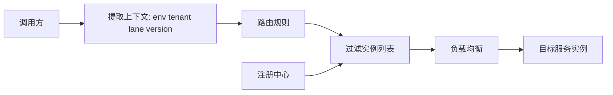
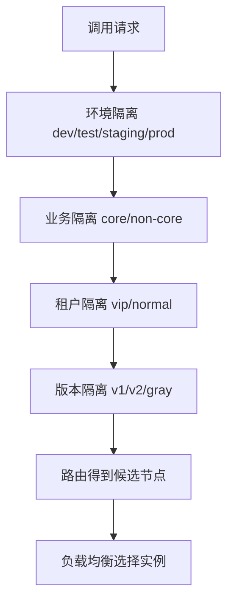

# 16 业务分组：如何隔离流量

业务分组是 RPC 治理里很实用的一层隔离手段。它不是单纯给服务起一个别名，而是把调用关系按照环境、租户、业务线、版本、地域、泳道或风险等级拆开，让不同流量走不同的服务集合。

当系统规模变大后，“所有调用方都访问同一批服务实例”会带来明显风险：测试流量污染生产、低优先级任务挤占核心资源、灰度版本影响全量用户、某个租户流量突增拖垮所有租户。业务分组就是为了解决这些隔离问题。

## 本章要解决的问题

本章关注如何通过分组机制隔离流量，做到：

- 生产、预发、测试环境互不串流。
- 不同业务线可以使用不同服务实例和配置。
- 灰度用户只访问灰度服务。
- 大客户、普通客户、内部任务拥有不同资源池。
- 故障发生时可以把影响面限制在单个分组内。

## 核心观点

- 分组本质上是路由维度，不只是注册中心里的元数据。
- 分组要在调用方、注册中心、服务端鉴权和观测系统中保持一致。
- 分组隔离既可以是逻辑隔离，也可以进一步演进为物理隔离。
- 分组规则要有默认兜底，但不能默默跨组调用。
- 分组越多，治理复杂度越高，需要自动化配置和审计。

## 原理拆解

服务注册时携带分组元数据，调用方根据请求上下文选择目标分组，再通过路由规则过滤实例。



常见分组维度：

```text
env       环境分组：prod / staging / test
group     业务分组：trade / content / risk
tenant    租户分组：tenant-a / tenant-b
lane      泳道分组：gray-001 / campaign-618
version   版本分组：v1 / v2
region    地域分组：cn-east / cn-north
```

分组路由通常遵循“精确匹配优先，兜底匹配最后”的原则。例如请求携带 `lane=gray-001`，就优先找同泳道实例；如果该泳道没有对应服务，要根据策略决定失败、回退到基线环境，还是只允许部分只读接口回退。

## 工程实践

服务提供方注册元数据：

```yaml
rpc:
  provider:
    service: OrderService
    version: v2
    metadata:
      env: prod
      group: trade
      lane: baseline
      region: cn-east
      tenantMode: shared
```

调用方路由规则：

```yaml
rpc:
  route:
    defaultPolicy: fail-fast
    rules:
      - match:
          service: OrderService
          header.lane: gray-001
        routeTo:
          lane: gray-001
        fallback:
          lane: baseline
          onlyMethods: ["queryOrder", "listOrders"]
      - match:
          tenant: vip-a
        routeTo:
          group: vip-dedicated
```

分组信息一般来自请求头、网关、登录态、租户配置或灰度平台。重要的是，分组上下文必须沿 RPC 链路透传，不能只在入口服务生效。

```java
class GroupContextInterceptor implements RpcClientInterceptor {
    public RpcResponse intercept(RpcRequest request, Chain chain) {
        GroupContext ctx = GroupContext.current();
        request.header("x-rpc-env", ctx.env());
        request.header("x-rpc-group", ctx.group());
        request.header("x-rpc-lane", ctx.lane());
        request.header("x-rpc-tenant", ctx.tenant());
        return chain.next(request);
    }
}
```

如果已经接入 OpenTelemetry，可以把分组字段写入 baggage 或 span attributes，既方便下游读取，也方便按分组观测错误率和延迟。

```text
baggage: rpc.env=prod,rpc.lane=gray-001,rpc.tenant=vip-a
span attribute: rpc.route.group=trade
```

权限校验也很关键。服务端不能只相信客户端传来的分组头，否则一个错误配置或恶意调用就可能跨组访问。

生产 checklist：

- 分组字段是否有统一命名和来源？
- 调用链路是否全程透传分组上下文？
- 注册中心实例元数据是否可信、可审计？
- 无匹配分组时是失败还是回退？是否按接口区分？
- 监控指标是否能按 env、group、lane、tenant 聚合？
- 是否禁止测试分组调用生产分组？

### 补充图示：分组隔离的四层边界



分组隔离最好从粗到细逐层收敛。先保证环境不串，再保证核心链路和非核心链路不互相拖累，最后才考虑租户、版本和灰度。

## 常见坑

- 只在网关做分组，内部 RPC 调用丢失上下文。
- 默认兜底到生产基线，导致灰度故障悄悄影响全量服务。
- 分组字段由业务随意命名，路由规则越来越难维护。
- 服务端不校验分组权限，调用方可以任意指定目标组。
- 分组数量失控，每个活动都创建新分组，注册中心和配置平台负担变大。
- 监控没有分组维度，故障时看不到是哪条泳道或哪个租户出问题。

## 面试追问

1. RPC 分组和服务版本有什么区别？
2. 灰度泳道为什么需要全链路透传？
3. 分组路由没有匹配实例时应该怎么处理？
4. 如何防止测试流量打到生产服务？
5. 多租户系统中逻辑隔离和物理隔离如何取舍？
6. 分组信息应该放在请求头、注册元数据还是配置中心？

## 小结

业务分组的价值是把“一个大系统”拆成多个可控的流量空间。它让灰度、租户、环境、业务线和地域都能拥有自己的路由边界。

分组做得好，事故影响面会明显变小；分组做得乱，系统会变成一张看不清边界的路由网。可靠的分组治理，既要有规则，也要有观测和审计。
