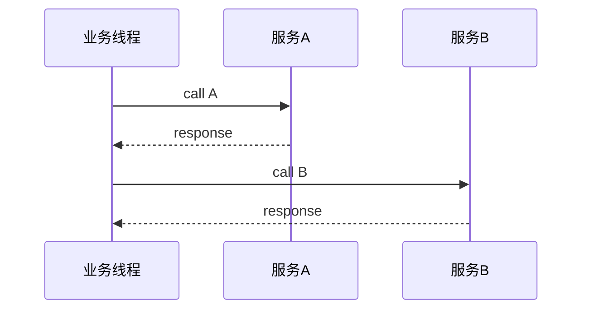
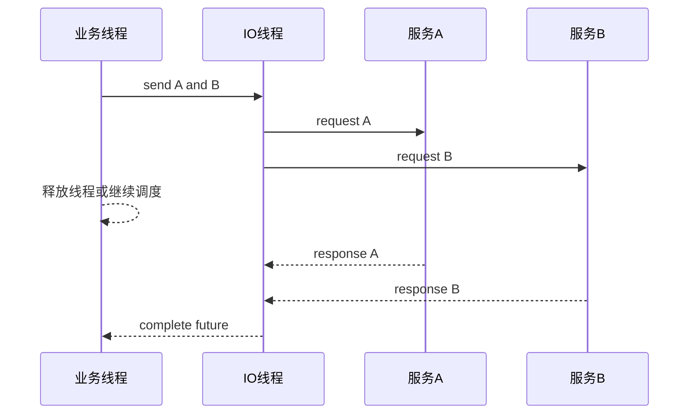

# 17 异步 RPC：压榨单机吞吐量

同步 RPC 的编程模型很直观：发起调用，阻塞等待，拿到结果继续执行。但在高并发场景里，大量线程其实不是在计算，而是在等待网络响应。异步 RPC 的核心价值，就是把线程从等待中释放出来，让单机资源更多用于真正的调度、编解码和业务计算。

异步不是为了让代码更炫，而是为了提高资源利用率，并降低长尾等待对线程池的拖累。

## 本章要解决的问题

当一个入口请求需要调用多个下游时，同步串行会把总耗时变成所有下游耗时之和；同步并行虽然能降低耗时，但仍然可能占用大量等待线程。随着 QPS 上升，线程栈内存、上下文切换、连接等待都会成为瓶颈。

异步 RPC 要解决的是：

- 请求等待期间不占用业务线程。
- 多个下游调用可以并行聚合。
- 单机在同等线程数下承载更多并发。
- 慢依赖不会轻易拖垮入口线程池。
- 超时、取消、上下文透传仍然可控。

## 核心观点

- 异步 RPC 提升的是资源利用率，不会让下游本身变快。
- 异步模型必须配套超时、取消、背压和异常聚合。
- Future、Callback、Promise、CompletableFuture、Reactive Stream 都是异步表达方式。
- 异步链路更容易丢失 Trace、日志上下文和安全上下文，必须显式透传。
- 异步不是无限并发，仍然需要隔离池、并发上限和队列保护。

## 原理拆解

同步模型：



异步聚合模型：



RPC 框架在发送请求时生成 `requestId`，把 `requestId -> Promise` 放入 pending map。响应回来后，IO 线程根据 `requestId` 找到对应 Promise 并完成它。

```text
send(request):
    id = nextRequestId()
    promise = new Promise()
    pending[id] = promise
    channel.write(encode(id, request))
    return promise.future()

onResponse(response):
    promise = pending.remove(response.id)
    promise.complete(response.body)
```

异步模型最容易忽略的是 pending map 的清理。如果超时请求没有及时移除，响应永远不回来时就会造成内存泄漏。

## 工程实践

Java 中可以使用 `CompletableFuture` 组织多个 RPC 结果：

```java
CompletableFuture<User> userFuture =
    userClient.getUserAsync(userId).orTimeout(200, TimeUnit.MILLISECONDS);

CompletableFuture<List<Coupon>> couponFuture =
    couponClient.listAsync(userId).orTimeout(150, TimeUnit.MILLISECONDS)
        .exceptionally(e -> List.of());

CompletableFuture<Risk> riskFuture =
    riskClient.evaluateAsync(userId).orTimeout(100, TimeUnit.MILLISECONDS);

return userFuture.thenCombine(couponFuture, UserView::new)
    .thenCombine(riskFuture, UserView::withRisk)
    .get(250, TimeUnit.MILLISECONDS);
```

这里有几个细节：

- 每个下游有自己的超时。
- 整体聚合也有总超时。
- 非关键依赖可以降级为空结果。
- 关键依赖失败则整体失败。

异步调用还要处理上下文透传。日志 MDC、TraceId、租户、JWT 摘要、灰度泳道都不能依赖线程本地变量自然存在，因为回调可能在另一个线程执行。

```java
ContextSnapshot snapshot = ContextSnapshot.capture();

rpcClient.invokeAsync(request)
    .whenCompleteAsync(snapshot.wrap((response, error) -> {
        if (error != null) {
            log.warn("rpc failed, traceId={}", TraceContext.currentTraceId(), error);
            return;
        }
        handle(response);
    }), callbackExecutor);
```

如果使用 OpenTelemetry，建议在异步发送时创建 client span，在响应、异常或超时时结束 span，并把 trace context 注入 RPC headers。

并发保护也很重要：

```yaml
rpc:
  async:
    maxPendingRequests: 50000
    maxPendingPerMethod: 2000
    timeoutScannerIntervalMs: 50
    callbackExecutor:
      coreThreads: 16
      maxThreads: 64
      queueSize: 10000
```

当 pending 请求超过阈值时，要快速拒绝或触发背压，而不是继续接收无限请求。

## 常见坑

- 异步调用没有总超时，Future 永远不完成。
- pending map 超时不清理，流量一高就内存泄漏。
- 回调里执行阻塞逻辑，把 IO 线程卡住。
- 异步后丢失 TraceId、MDC、租户、灰度分组等上下文。
- 对下游无限并发，导致自身没被线程阻塞，却把下游打崩。
- 异常处理分散在多个 Future 中，最终返回结果不确定。

## 面试追问

1. 异步 RPC 为什么能提升吞吐量？
2. 异步调用和同步调用在服务端压力上有什么区别？
3. requestId 和 pending map 在异步 RPC 中起什么作用？
4. 为什么不能在 IO 线程里执行重业务回调？
5. 异步场景如何做超时、取消和资源清理？
6. OpenTelemetry 上下文在异步链路中如何透传？

## 小结

异步 RPC 的本质是把“等待网络”的成本从业务线程里拿掉，用 Future 或回调表达未完成的结果。它能显著提高单机并发利用率，但也会带来上下文、超时、背压和异常处理的复杂度。

真正成熟的异步 RPC，不是把接口改成 `Future` 就结束了，而是让等待、失败、取消、追踪和限流都变得可控。
