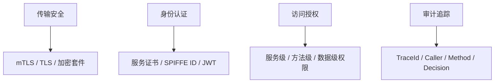
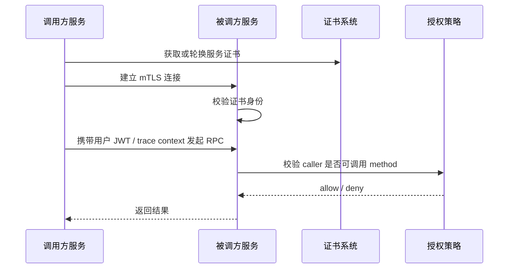

# 18 安全体系：如何建立可靠的安全体系

RPC 调用通常发生在内网，但“内网可信”已经不是一个可靠假设。服务数量越多、调用链越复杂、容器和云环境越动态，越需要把 RPC 安全体系当成基础能力建设。

可靠的 RPC 安全体系至少要覆盖四件事：谁在调用，能不能调用，传输是否安全，以及出了问题能不能追溯。

## 本章要解决的问题

本章关注如何避免以下风险：

- 非法服务伪装成合法调用方访问内部接口。
- 某个服务越权调用不该访问的敏感接口。
- 明文传输导致请求参数、Token、用户数据被窃听。
- JWT、API Key、证书泄漏后无法快速止损。
- 调用链缺少审计记录，事故后查不清是谁调用了什么。

RPC 安全不是在网关做一次鉴权就够了。内部服务之间同样需要身份、权限、传输、审计和密钥生命周期管理。

## 核心观点

- 身份认证解决“你是谁”，授权解决“你能做什么”。
- mTLS 适合服务到服务身份认证和传输加密。
- JWT 适合传递用户身份和声明，但不能替代服务身份。
- 权限控制要下沉到服务和方法级，不能只依赖入口网关。
- 安全体系必须可轮换、可撤销、可审计。

## 原理拆解

RPC 安全可以分成四层：



一次安全的 RPC 调用大致如下：



mTLS 解决的是服务身份和传输加密。服务端可以从客户端证书中识别调用方，例如 `spiffe://prod/ns/trade/sa/order-service`。JWT 更多用于表达用户身份、租户、角色、会话等声明。两者不要混用：服务证书证明“哪个服务在调用”，JWT 证明“代表哪个用户或主体在操作”。

## 工程实践

服务身份可以采用 SPIFFE/SPIRE、服务网格或自建证书系统。配置示例：

```yaml
rpc:
  security:
    mtls:
      enabled: true
      certFile: /etc/certs/tls.crt
      keyFile: /etc/certs/tls.key
      trustBundle: /etc/certs/ca.crt
      requireClientAuth: true
    identity:
      serviceId: spiffe://prod/ns/trade/sa/order-service
```

服务端授权策略应尽量做到方法级：

```yaml
rpc:
  authorization:
    policies:
      - resource: PaymentService.charge
        allowCallers:
          - spiffe://prod/ns/trade/sa/order-service
        requireUserClaims:
          - tenant_id
          - user_id
      - resource: UserService.getSensitiveProfile
        allowCallers:
          - spiffe://prod/ns/customer/sa/profile-service
        roles:
          - customer_profile_reader
```

拦截器伪代码：

```java
RpcResponse intercept(RpcRequest request, Chain chain) {
    ServiceIdentity caller = mtls.extractPeerIdentity(request.connection());
    UserPrincipal user = jwtVerifier.verify(request.header("authorization"));
    AuthDecision decision = authorizer.check(
        caller,
        user,
        request.service(),
        request.method()
    );

    audit.log(request.traceId(), caller, user.subject(), request.method(), decision);

    if (!decision.allowed()) {
        return RpcResponse.permissionDenied("rpc access denied");
    }
    return chain.next(request);
}
```

OpenTelemetry 可以帮助安全审计串起上下文。建议在 span attributes 中记录低敏字段：

```text
rpc.system=grpc
rpc.service=PaymentService
rpc.method=charge
enduser.id_hash=...
rpc.caller.service=order-service
auth.decision=allow
tenant.id=tenant-a
```

不要把完整 JWT、手机号、身份证、银行卡号写入日志或 trace。审计要能定位问题，但不能制造新的数据泄漏面。

安全 checklist：

- 服务间调用是否启用 mTLS？
- 调用方身份是否来自可信证书，而不是普通 header？
- JWT 是否校验签名、过期时间、issuer、audience？
- 方法级授权是否覆盖敏感接口？
- 证书和密钥是否支持自动轮换？
- 拒绝访问是否有审计记录和告警？
- Trace 和日志是否避免记录敏感原文？

## 常见坑

- 认为内网调用不需要鉴权，结果任意服务都能访问敏感接口。
- 只在网关校验用户身份，内部 RPC 完全信任入口传来的 header。
- 把服务身份放在可伪造的 `x-service-name` header 中。
- JWT 只解码不验签，或者不校验过期时间和 audience。
- 证书有效期过长，泄漏后无法快速止损。
- 审计日志没有 traceId，事故后无法还原调用链。
- 把完整 Token 和敏感参数写进日志系统。

## 面试追问

1. mTLS 在 RPC 安全中解决什么问题？
2. JWT 和服务证书的职责有什么区别？
3. 为什么内部服务调用也需要鉴权？
4. 方法级授权应该放在框架层还是业务层？
5. 证书轮换期间如何避免服务不可用？
6. 安全审计应该记录哪些字段，又不应该记录哪些字段？

## 小结

RPC 安全体系不是一个单独的开关，而是一组贯穿调用链的基础能力：传输加密、服务身份、用户身份、访问授权、密钥轮换和审计追踪。

当服务越来越多时，安全不能靠“大家都自觉”。可靠的 RPC 安全体系，应该让合法调用顺畅发生，让非法调用明确失败，并且让每一次关键访问都能被追溯。
