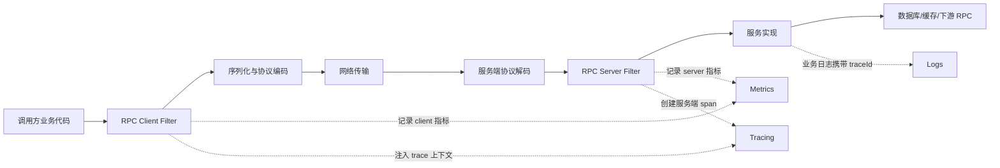
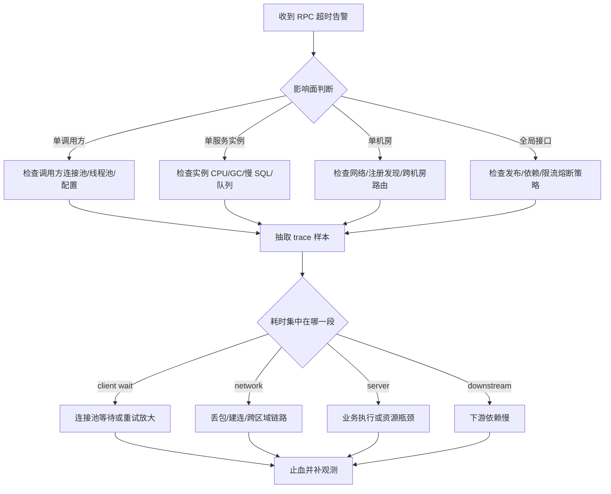

# 19 分布式环境下如何快速定位问题

RPC 系统最让人头疼的不是“失败”，而是失败发生在一条跨服务、跨线程、跨机器的链路上。一次接口超时，可能是调用方线程池满了，可能是网络抖动，也可能是服务方慢 SQL、序列化膨胀、注册中心推送延迟。定位问题的关键不是记住更多命令，而是建立一套能把现场串起来的方法。

## 本章要解决的问题

当线上出现 RPC 调用超时、错误率升高、局部慢调用或偶发失败时，我们需要回答四个问题：

- 影响面有多大：是单接口、单机房、单调用方，还是全链路故障。
- 故障发生在哪里：客户端、网络、服务端、依赖资源、注册发现或治理策略。
- 故障从什么时候开始：是否与发布、扩容、配置变更、流量突增有关。
- 如何止血与复盘：先恢复业务，再沉淀可观测性和防护策略。

## 核心观点

分布式排障要依赖“日志、指标、链路追踪”三件套，但不能把它们当作三个孤立系统。日志回答“发生了什么”，指标回答“趋势是否异常”，链路追踪回答“慢在哪里”。真正有效的排障，是用 `traceId` 把一次调用的上下文贯穿起来，再用指标缩小范围，最后用日志确认细节。

RPC 框架应该默认透传以下上下文：

- `traceId` / `spanId`：串联调用链。
- `requestId`：匹配一次 RPC 请求和响应。
- `caller` / `callee`：标识调用方与服务方。
- `method` / `version` / `group`：定位接口、版本和流量分组。
- `timeout` / `retry`：判断失败是否由策略放大。

## 原理拆解

一次 RPC 调用的可观测性可以拆成四层。



排障时不要从最细的日志开始翻，而是先用指标判断故障形态。

| 现象 | 优先怀疑 | 观察指标 |
| --- | --- | --- |
| 客户端超时升高，服务端无请求 | 网络、路由、连接池、注册发现 | 连接数、建连失败、路由命中、客户端 QPS |
| 客户端超时升高，服务端耗时也升高 | 服务端处理慢 | Server RT、线程池队列、GC、慢 SQL |
| 错误率升高但 RT 正常 | 参数、版本、序列化、权限 | 异常类型分布、状态码、版本标签 |
| 少量调用方异常 | 调用方配置或分组问题 | caller 维度指标、配置变更记录 |
| 发布后逐步恶化 | 资源泄漏、连接未释放、缓存预热不足 | 连接数、堆内存、线程数、缓存命中率 |

## 工程实践

### 1. 建立 RPC 排障模板

每次事故复盘都可以按下面模板记录，避免排障变成临场发挥。

```markdown
## 事故摘要
- 时间窗口：
- 影响接口：
- 影响调用方：
- 影响比例：
- 用户感知：

## 关键证据
- 指标异常：
- 链路追踪样本：
- 错误日志：
- 发布/配置变更：

## 初步定位
- 故障层次：客户端 / 网络 / 服务端 / 依赖 / 治理策略
- 触发因素：
- 放大因素：

## 止血动作
- 摘除节点：
- 回滚版本：
- 调整限流/熔断/重试：
- 切换分组：

## 后续改进
- 监控补齐：
- 告警调整：
- 框架防护：
- 演练计划：
```

### 2. 慢调用分析路径

1. 先看 `p95`、`p99`，不要只看平均值。
2. 按 `method`、`caller`、`calleeNode`、`status`、`group` 拆维度。
3. 抽取慢调用 trace，检查客户端等待、网络传输、服务端执行、下游依赖分别耗时多少。
4. 对比同接口快慢样本，找差异：参数大小、命中节点、依赖资源、是否重试。
5. 确认是否有策略放大：重试风暴、超时时间过长、连接池等待。

### 3. 生产 checklist

- 所有 RPC 日志必须携带 `traceId`、接口名、耗时、状态码。
- 客户端和服务端分别记录指标，避免只看到一半现场。
- 高基数字段要控制：用户 ID 不适合作为默认指标标签。
- 采样策略要支持错误强制采样、慢调用强制采样。
- 发布、配置、扩容事件要进入同一观测面板。
- 超时、重试、熔断、限流策略要能在日志中解释出来。

### 4. 补充图示：一次慢调用的定位路径



### 5. 代码示例：RPC Filter 中注入 trace 与指标

下面是一个简化版客户端过滤器。真实项目中可以对接 OpenTelemetry、Micrometer 或公司内部观测 SDK。

```java
public final class ObservabilityClientFilter implements RpcClientFilter {
    private final MeterRegistry meterRegistry;
    private final Tracer tracer;

    @Override
    public RpcResponse invoke(RpcRequest request, RpcInvoker next) {
        String traceId = TraceContext.currentTraceId();
        request.putAttachment("traceId", traceId);
        request.putAttachment("caller", request.getCaller());

        Timer.Sample sample = Timer.start(meterRegistry);
        Span span = tracer.spanBuilder(request.getServiceName() + "." + request.getMethodName())
                .setAttribute("rpc.system", "custom-rpc")
                .setAttribute("rpc.service", request.getServiceName())
                .setAttribute("rpc.method", request.getMethodName())
                .setAttribute("rpc.caller", request.getCaller())
                .startSpan();

        try (Scope ignored = span.makeCurrent()) {
            RpcResponse response = next.invoke(request);
            span.setAttribute("rpc.status_code", response.getStatusCode());
            return response;
        } catch (Exception e) {
            span.recordException(e);
            span.setAttribute("rpc.error", true);
            throw e;
        } finally {
            sample.stop(Timer.builder("rpc.client.duration")
                    .tag("service", request.getServiceName())
                    .tag("method", request.getMethodName())
                    .tag("caller", request.getCaller())
                    .register(meterRegistry));
            span.end();
        }
    }
}
```

## 常见坑

- 只看服务端监控，忽略客户端连接池和路由选择。
- 所有异常都打印大段堆栈，导致日志成本高但检索困难。
- 指标标签无限膨胀，把监控系统本身打垮。
- 没有区分业务失败和框架失败，导致错误率含义混乱。
- trace 采样率太低，真正出问题的样本没有被保留下来。
- 重试没有记录第几次尝试，复盘时看不出失败被放大。

## 面试追问

**问题 1：为什么有了日志还需要链路追踪？**  
日志能描述单点事件，但跨服务调用需要知道父子关系和耗时分布。链路追踪把多个服务的片段组织成一棵调用树，可以快速定位瓶颈发生在哪一段。

**问题 2：RED 和 USE 指标分别适合什么场景？**  
RED 关注请求层面的 Rate、Errors、Duration，适合 RPC 接口观测。USE 关注资源层面的 Utilization、Saturation、Errors，适合 CPU、磁盘、线程池、连接池等资源排查。

**问题 3：为什么 p99 比平均耗时更重要？**  
RPC 系统中的少量慢请求会拖垮线程池、触发超时重试，并影响用户体验。平均值会掩盖长尾问题，而 p99 更能暴露抖动和资源争用。

## 小结

分布式排障的核心是把现场还原出来：用指标发现异常，用 trace 串联路径，用日志确认原因。RPC 框架越成熟，越应该把观测能力前置到协议、过滤器、上下文和治理策略中。优秀的排障体系不是事故发生后才找线索，而是在每一次调用发生时就留下足够克制、足够有用的证据。
