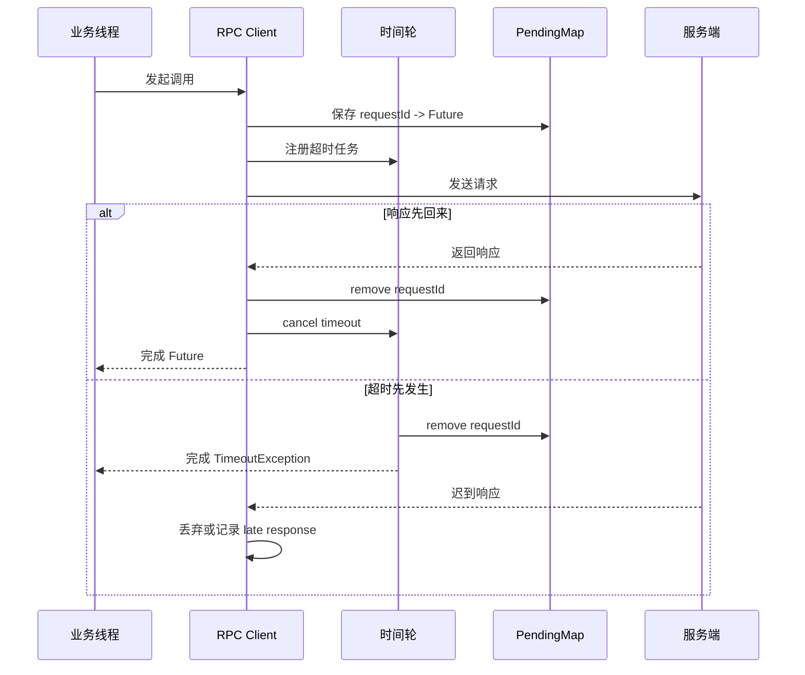

# 20 详解时钟轮在 RPC 中的应用

RPC 框架里有大量“将来要执行”的任务：请求超时、心跳检测、连接空闲关闭、重试调度、熔断半开探测。如果每个任务都直接交给普通定时器或优先队列，高并发下会产生明显的插入、删除和唤醒开销。时间轮就是为这类海量定时任务准备的一种工程化方案。

## 本章要解决的问题

本章讨论三个问题：

- RPC 框架为什么会产生大量定时任务。
- 时间轮如何降低超时任务管理成本。
- 在实际框架中使用时间轮要注意哪些精度、资源和取消问题。

## 核心观点

时间轮牺牲了一定时间精度，换取稳定的任务管理成本。它不追求每个任务在纳秒级准时触发，而是把时间切成一个个槽位，将到期时间相近的任务放在同一批次处理。对于 RPC 超时、重试、心跳这类允许毫秒级误差的场景，这种取舍非常划算。

在 RPC 中，时间轮适合管理：

- 请求超时：到期后从 `pendingRequests` 中移除并完成异常响应。
- 连接空闲：长期无读写的连接触发关闭或探活。
- 心跳任务：周期性发送 ping 或 health check。
- 重试调度：按退避时间重新发起调用。
- 熔断探测：半开窗口到期后放行少量请求。

## 原理拆解

一个简单时间轮包含三个核心概念：

- `tick`：时间轮前进一步的间隔，例如 100ms。
- `slot`：槽位数组，每个槽位挂载一批任务。
- `round`：任务距离触发还需要绕几圈。

```mermaid
flowchart TB
    A[新增定时任务 timeout=750ms] --> B[计算 ticks=ceil(750/100)=8]
    B --> C[slot=(current+8)%slotCount]
    C --> D[round=floor(8/slotCount)]
    D --> E[挂入目标槽位链表]
    F[时钟推进] --> G[扫描当前槽位]
    G --> H{round 是否为 0}
    H -- 否 --> I[round-- 留在槽位]
    H -- 是 --> J[执行或提交任务]
```

如果使用普通优先队列，插入和删除通常是 `O(logN)`；时间轮在理想情况下插入接近 `O(1)`。当一个 RPC 客户端同时维护几十万未完成请求时，这个差异会非常明显。

### 请求超时的典型流程



## 工程实践

### 1. 简化版伪代码

```java
class TimerTask {
    long deadline;
    int rounds;
    Runnable action;
    volatile boolean cancelled;
}

class HashedWheel {
    List<Queue<TimerTask>> slots;
    int current;
    long tickMillis;

    Timeout schedule(Runnable action, long delayMillis) {
        long ticks = Math.max(1, (delayMillis + tickMillis - 1) / tickMillis);
        int slot = (int) ((current + ticks) % slots.size());
        int rounds = (int) (ticks / slots.size());
        TimerTask task = new TimerTask(now() + delayMillis, rounds, action);
        slots.get(slot).add(task);
        return () -> task.cancelled = true;
    }

    void advance() {
        current = (current + 1) % slots.size();
        for (TimerTask task : slots.get(current)) {
            if (task.cancelled) continue;
            if (task.rounds > 0) {
                task.rounds--;
            } else if (now() >= task.deadline) {
                task.action.run();
            }
        }
    }
}
```

真实实现还要处理并发插入、槽位清理、任务取消、异常隔离和关闭流程。Netty 的 `HashedWheelTimer` 就是常见参考，它适合低精度、高吞吐的定时任务场景。

### 2. 参数选择

| 参数 | 建议 | 说明 |
| --- | --- | --- |
| `tickDuration` | 10ms 到 100ms | 越小越精确，但扫描越频繁 |
| `wheelSize` | 2 的幂更方便 | 槽位多可减少单槽任务堆积 |
| 执行线程 | 不直接跑重任务 | 时间轮线程只负责触发，业务任务交给线程池 |
| 取消策略 | 标记取消 + 延迟清理 | 避免频繁从链表中删除 |
| 最大超时 | 设置上限 | 防止极大延迟任务长期占用内存 |

### 3. 实践 checklist

- 超时时间必须与调用方总预算一致，不能每次重试都重新拿满额预算。
- 响应回来后要及时从 pending 表移除，并取消超时任务。
- 迟到响应要记录采样日志，用于分析服务端慢处理。
- 时间轮线程中不要执行阻塞逻辑。
- 大量取消任务时要关注槽位中的“墓碑任务”堆积。
- 应用关闭时要停止时间轮，并清理未完成 Future。

## 常见坑

- 把时间轮当成精确定时器，要求任务准点执行。
- 每个客户端、每个接口都创建一个时间轮，导致线程和内存浪费。
- 超时任务触发后没有清理 pending 请求，最终内存泄漏。
- 时间轮线程直接执行复杂回调，导致后续超时触发整体延迟。
- 只设置客户端超时，不考虑服务端继续执行造成的资源浪费。
- 取消任务时从链表中同步删除，锁竞争反而变高。

## 面试追问

**问题 1：时间轮和优先队列定时器的区别是什么？**  
优先队列按到期时间排序，精度高但插入删除成本随任务数增长。时间轮按时间槽分桶，插入成本低，适合大量近似定时任务，但触发精度受 tick 影响。

**问题 2：为什么 RPC 超时适合时间轮？**  
RPC 超时通常允许毫秒级误差，且并发请求多、任务生命周期短。时间轮能用较低成本管理大量超时任务，符合 RPC 的吞吐诉求。

**问题 3：层级时间轮解决什么问题？**  
单层时间轮如果要支持很长超时，需要非常多槽位或很多 round。层级时间轮用多个粒度不同的轮子管理短期和长期任务，兼顾内存占用和时间跨度。

## 小结

时间轮是 RPC 框架里典型的“用工程取舍换稳定性”的设计。它不追求绝对精确，而是让超时、心跳、重试这些高频任务以可控成本运行。真正落地时，重点不是写出一个能转的轮子，而是处理好任务取消、迟到响应、线程隔离和超时预算这些细节。
