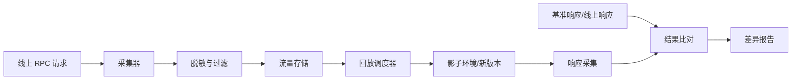
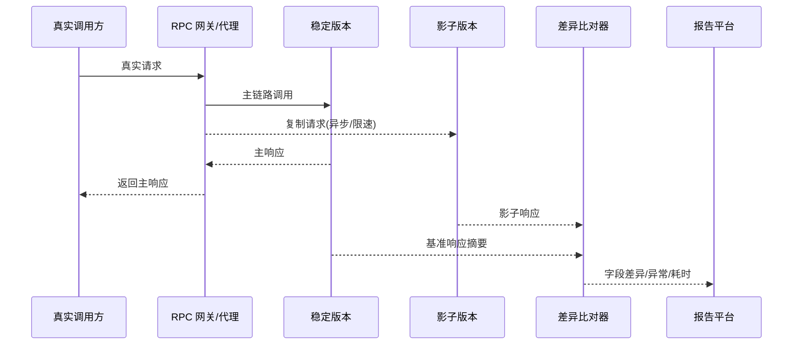

# 21 流量回放：保障业务技术升级的神器

技术升级最怕“测试环境一切正常，线上一放量就出事”。RPC 框架升级、协议迁移、序列化替换、服务重构，都可能在真实参数、真实调用频率和真实依赖状态下暴露问题。流量回放的价值，就是把线上已经发生过的调用安全地复制到验证环境，用真实流量检验新系统。

## 本章要解决的问题

本章关注：

- 如何采集 RPC 真实请求，并在隔离环境中回放。
- 如何避免回放对真实业务造成副作用。
- 如何比较旧系统与新系统的响应差异。
- 如何用流量回放支撑框架升级、协议迁移和重构验证。

## 核心观点

流量回放不是简单地“把请求再打一遍”。它是一套包含采集、脱敏、限速、隔离、重放、比对、报告的工程体系。越接近生产流量，越要重视安全边界；越希望自动化验证，越要建立稳定的结果比对规则。

常见模式有三种：

- 录制回放：把线上请求落盘，离线或准实时回放。
- 影子流量：在线复制请求到新版本，但不影响主链路返回。
- 镜像流量：在网关或代理层复制流量，适合协议或基础设施迁移。

## 原理拆解



采集层通常记录以下内容：

- 服务名、方法名、版本、分组。
- 请求头、上下文、调用方信息。
- 参数类型、参数值、序列化格式。
- 原始响应状态、耗时、异常类型。
- 调用时间，用于按原始节奏或倍速回放。

对于写请求，不能直接在真实环境回放。它们需要进入隔离数据库、Mock 依赖，或只做参数解析和业务校验，不提交最终副作用。

## 工程实践

### 1. 迁移方案示例：序列化协议升级

假设要从 JSON 升级到 Protobuf，可以按以下阶段推进：

1. 双写元数据：服务同时暴露旧协议和新协议描述。
2. 采集线上 JSON 请求，记录接口、参数和响应摘要。
3. 在回放环境中用 Protobuf 编码发起调用。
4. 比对业务字段、异常类型和耗时分布。
5. 灰度少量真实调用方，保留降级开关。
6. 扩大比例，最终关闭旧协议入口。

### 2. 结果比对规则

不是所有字段都应该逐字节比较。建议把比对分成三层：

| 层级 | 比对内容 | 示例 |
| --- | --- | --- |
| 协议层 | 状态码、异常类型、序列化成功率 | 是否出现 decode error |
| 业务层 | 核心字段、集合大小、金额、状态机 | 订单状态是否一致 |
| 性能层 | p50/p95/p99、错误率、资源占用 | 新版本 p99 是否劣化 |

对于时间戳、随机数、流水号、排序不稳定列表，可以配置忽略字段或归一化函数。

### 3. 回放前安全 checklist

- 是否过滤写接口，或确认写入影子库。
- 是否完成用户信息、手机号、证件号等敏感字段脱敏。
- 是否限制回放 QPS，避免压垮验证环境。
- 是否隔离消息队列、短信、支付、通知等外部副作用。
- 是否设置独立调用方身份，避免污染线上审计。
- 是否能一键停止回放任务。
- 是否记录回放批次和差异报告，便于复盘。

### 4. 排障模板

```markdown
## 回放批次
- 来源时间段：
- 接口范围：
- 请求数量：
- 回放倍率：

## 差异摘要
- 协议错误：
- 业务字段差异：
- 性能劣化：
- 未知异常：

## 初步原因
- 参数兼容：
- 数据环境：
- 依赖 Mock：
- 新版本逻辑：

## 处理结论
- 可忽略差异：
- 必须修复：
- 需要补充采集字段：
```

### 5. 补充图示：影子流量闭环



影子流量的核心约束是：主链路结果只来自稳定版本，影子版本永远不能影响用户响应。

### 6. 代码示例：响应差异比对器

```java
public final class ReplayDiffChecker {
    private final Set<String> ignoredFields = Set.of(
            "traceId", "requestTime", "serverTime", "serialNo"
    );

    public DiffResult compare(JsonNode baseline, JsonNode candidate) {
        DiffResult result = new DiffResult();
        compareNode("", baseline, candidate, result);
        return result;
    }

    private void compareNode(String path, JsonNode left, JsonNode right, DiffResult result) {
        if (ignoredFields.contains(lastPathName(path))) {
            return;
        }
        if (left == null || right == null) {
            if (left != right) {
                result.add(path, left, right);
            }
            return;
        }
        if (left.isObject() && right.isObject()) {
            Iterator<String> names = left.fieldNames();
            while (names.hasNext()) {
                String name = names.next();
                compareNode(path + "/" + name, left.get(name), right.get(name), result);
            }
            return;
        }
        if (!left.equals(right)) {
            result.add(path, left, right);
        }
    }

    private String lastPathName(String path) {
        int index = path.lastIndexOf('/');
        return index < 0 ? path : path.substring(index + 1);
    }
}
```

这段示例体现了一个关键点：比对器要支持忽略字段和归一化规则，否则时间戳、流水号、随机排序会制造大量无效差异。

## 常见坑

- 只回放读请求，却用结果证明写路径安全。
- 回放环境数据与生产差异太大，导致大量误报。
- 没有脱敏，流量平台变成敏感数据扩散源。
- 忽略上下文参数，比如租户、灰度标、鉴权信息。
- 比对规则过于严格，时间戳和随机字段制造噪音。
- 回放速度过快，把验证环境压垮后误判为新版本性能差。

## 面试追问

**问题 1：流量回放和压测有什么区别？**  
压测关注容量和性能上限，流量可以是构造的；流量回放关注真实业务兼容性，强调真实参数、真实调用分布和结果比对。两者可以结合，但目标不同。

**问题 2：写请求如何安全回放？**  
优先使用影子库、事务回滚、Mock 外部副作用、幂等键隔离和白名单接口。对支付、通知、库存扣减等强副作用接口，通常只做协议解析或沙箱调用。

**问题 3：影子流量为什么不能影响主链路？**  
影子调用用于验证新版本，不应改变用户看到的结果。主链路仍以旧系统响应为准，影子链路的异常只进入观测和报告。

## 小结

流量回放是技术升级的安全网。它让团队在真正切流前，用真实请求提前发现协议兼容、业务差异和性能劣化。好的回放平台一定不是“盲目复制流量”，而是把脱敏、隔离、限速和比对做扎实，让每一次升级都从拍脑袋变成有证据的工程决策。
