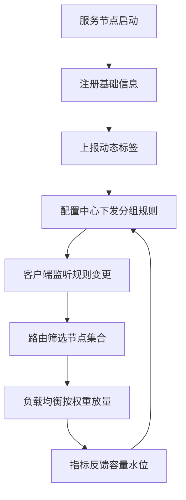
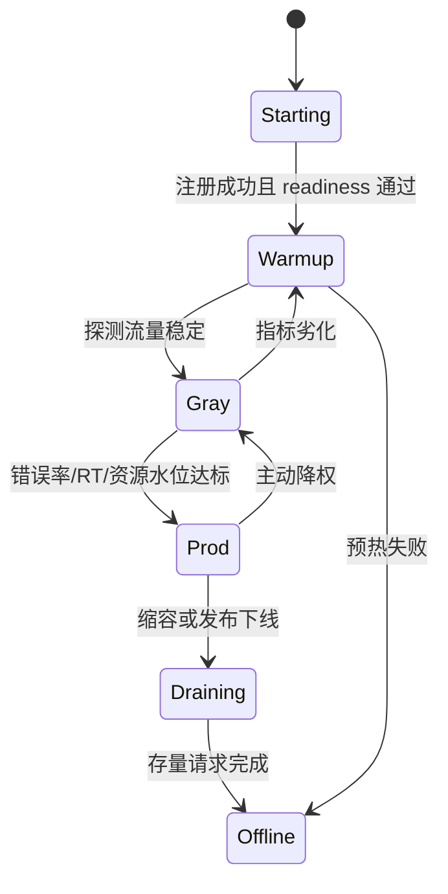

# 22 动态分组：超高效实现秒级扩缩容

RPC 服务扩缩容并不只是“多启动几台机器”。新节点什么时候能接流量，旧节点什么时候能退出，哪些调用方应该优先命中新节点，节点容量变化后如何平滑放量，这些问题都需要流量治理能力支撑。动态分组就是其中非常实用的一种手段。

## 本章要解决的问题

本章要回答：

- 动态分组和普通服务分组有什么区别。
- 如何通过分组实现秒级扩容、缩容和流量切换。
- 动态分组与注册中心、路由、负载均衡、预热策略如何配合。
- 扩缩容过程中如何避免流量突刺和连接抖动。

## 核心观点

分组的本质是给服务节点和调用请求打标签，再由路由规则决定哪些请求可以访问哪些节点。动态分组强调“运行时可变”：节点不需要重新发布，就能通过配置中心或注册中心元数据改变流量归属。

典型标签包括：

- `group=prod|gray|shadow`
- `zone=shanghai-a|shanghai-b`
- `capacity=small|medium|large`
- `version=v1|v2`
- `tenant=vip|normal`

动态分组不是替代自动扩缩容，而是把“资源变化”转化为“可控接流”。

## 原理拆解



动态分组通常参与三个阶段：

1. 扩容：新节点进入预热分组，少量接流，指标稳定后进入正式分组。
2. 缩容：目标节点先从正式分组移出，只保留存量连接或等待请求结束。
3. 灰度：指定调用方、用户标签或租户命中特定分组。

## 工程实践

### 1. 秒级扩容流程

```mermaid
sequenceDiagram
    participant Node as 新服务节点
    participant Registry as 注册中心
    participant Config as 配置中心
    participant Client as RPC 客户端
    participant Metrics as 监控系统

    Node->>Registry: 注册 group=warmup weight=0
    Config->>Client: 下发 warmup 路由规则
    Client->>Node: 1% 探测流量
    Metrics-->>Config: RT/错误率/CPU 正常
    Config->>Client: 权重提升到 10%
    Metrics-->>Config: 容量稳定
    Config->>Client: 加入 prod 分组并提升权重
```



### 2. 放量曲线设计

| 阶段 | 权重 | 观察窗口 | 退出条件 |
| --- | --- | --- | --- |
| 探测 | 1% | 1-3 分钟 | 错误率无明显升高 |
| 小流量 | 5%-10% | 5 分钟 | p99 不劣化 |
| 半量 | 30%-50% | 10 分钟 | 资源水位稳定 |
| 全量 | 100% | 持续观察 | 无新增告警 |

秒级扩容不代表秒级全量。真正稳妥的做法是秒级接入、分阶段放量。

### 3. 动态规则示例

```yaml
service: order-service
method: queryOrder
routes:
  - match:
      caller: checkout-service
      userTag: vip
    target:
      group: prod-v2
      weight: 20
  - match:
      caller: "*"
    target:
      group: prod-v1
      weight: 80
```

### 4. 实践 checklist

- 节点启动后先进入 `warmup`，不要直接加入正式分组。
- 分组规则必须有默认兜底，避免配置错误导致无节点可用。
- 客户端要监听配置变更并做到本地缓存。
- 权重变化要平滑，避免瞬时连接重建。
- 扩缩容事件要写入审计日志。
- 指标反馈要按分组聚合，不能只看服务整体平均值。

### 5. 补充图示：节点分组生命周期



### 6. 代码示例：按动态分组筛选节点

```java
public final class GroupRouter implements Router {
    @Override
    public List<ServiceInstance> route(RpcInvocation invocation,
                                       List<ServiceInstance> instances,
                                       RouteRule rule) {
        List<ServiceInstance> matched = instances.stream()
                .filter(instance -> matchCaller(invocation, rule))
                .filter(instance -> matchGroup(instance, rule.getTargetGroup()))
                .filter(instance -> matchZone(instance, invocation.getAttachment("zone")))
                .filter(ServiceInstance::isReady)
                .toList();

        if (!matched.isEmpty()) {
            return matched;
        }

        // 兜底策略很重要：配置错误时宁可回到稳定分组，也不要让调用方无节点可用。
        return instances.stream()
                .filter(instance -> "prod".equals(instance.getMetadata("group")))
                .filter(ServiceInstance::isReady)
                .toList();
    }

    private boolean matchCaller(RpcInvocation invocation, RouteRule rule) {
        return rule.getCallerPattern().matches(invocation.getCaller());
    }

    private boolean matchGroup(ServiceInstance instance, String group) {
        return group.equals(instance.getMetadata("group"));
    }

    private boolean matchZone(ServiceInstance instance, String requestZone) {
        return requestZone == null || requestZone.equals(instance.getMetadata("zone"));
    }
}
```

## 常见坑

- 分组命名随意，最后出现 `gray2-new-test-final` 这类不可维护规则。
- 新节点刚注册就全量接流，缓存、连接池、JIT 都没预热。
- 缩容时先杀进程再摘流，导致正在执行的请求失败。
- 客户端配置监听失败后没有兜底缓存。
- 路由规则和负载均衡权重互相打架，实际流量与预期不一致。
- 分组过细，运维复杂度超过收益。

## 面试追问

**问题 1：动态分组和路由规则是什么关系？**  
分组提供节点和请求的标签，路由规则使用这些标签筛选可用节点集合。分组是数据，路由是决策逻辑。

**问题 2：为什么扩容要预热？**  
新节点的缓存、连接池、线程池、JIT 和依赖连接都可能处于冷状态。直接全量接流会产生长尾延迟甚至错误，预热可以让节点逐步进入稳定状态。

**问题 3：如何避免动态配置错误造成全站故障？**  
需要配置校验、灰度下发、默认兜底、本地缓存、回滚版本和审计记录。关键服务还可以要求双人审批或自动仿真验证。

## 小结

动态分组把扩缩容从“机器数量变化”升级为“流量归属变化”。它让节点可以先准备、再接流、再放量，也让缩容可以先摘流、再等待、最后退出。在大规模 RPC 系统中，动态分组不是锦上添花，而是发布、灰度、扩容和容灾的基础能力。
