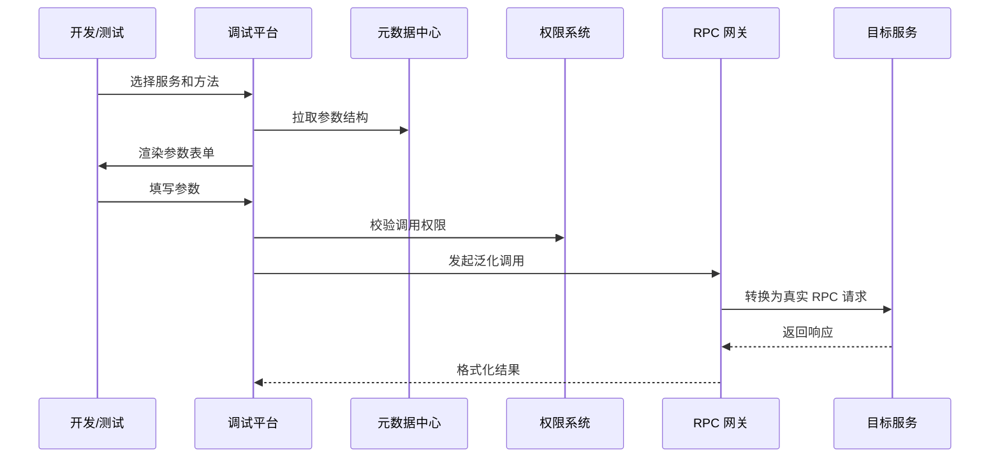
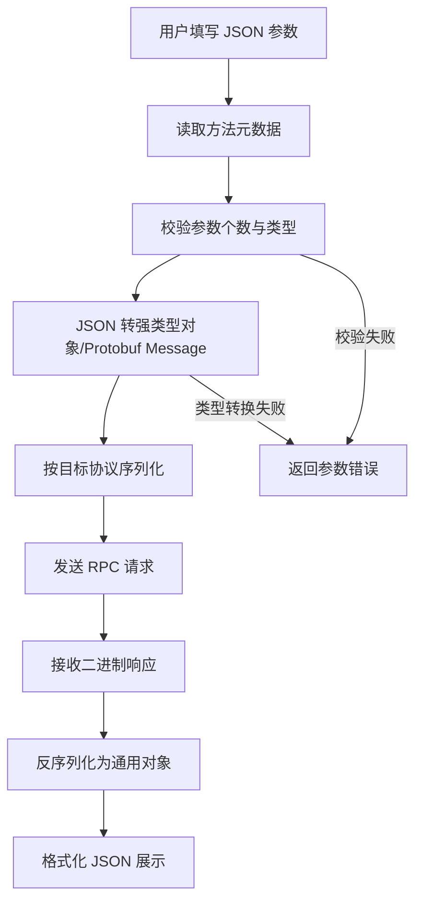

# 23 如何在没有接口的情况下进行 RPC 调用

常规 RPC 调用依赖本地接口：调用方引入接口包，框架生成代理，然后像调用本地方法一样发起远程调用。但在网关、测试平台、运维工具、跨语言调试等场景中，调用方可能没有接口类。此时就需要泛化调用，也叫动态调用。

## 本章要解决的问题

本章讨论：

- 没有本地接口时，RPC 调用需要哪些元数据。
- 泛化调用如何完成参数描述、序列化和响应解析。
- 泛化调用适合哪些场景，不适合哪些场景。
- 如何设计一个安全的接口调试平台。

## 核心观点

接口代理把“服务名、方法名、参数类型、参数值”隐藏在本地方法调用里；泛化调用则把这些信息显式暴露出来。也就是说，泛化调用不是没有契约，而是契约从代码接口转移到了元数据中心、IDL、反射服务或人工输入。

一次泛化调用至少需要：

- 服务标识：服务名、版本、分组。
- 方法标识：方法名或方法签名。
- 参数描述：参数类型、字段结构、泛型信息。
- 参数值：通常用 JSON、Map 或结构化对象表达。
- 序列化方式：JSON、Protobuf、Hessian 等。
- 调用上下文：超时、鉴权、租户、traceId。

## 原理拆解


泛化调用的关键在于“类型还原”。例如 JSON 里只有字符串和数字，但服务端方法可能需要 `BigDecimal`、枚举、嵌套对象、列表、Map。没有准确的元数据，调用就会在反序列化或方法匹配时失败。

## 工程实践

### 1. 泛化请求结构设计

```json
{
  "service": "com.example.OrderService",
  "version": "1.0.0",
  "group": "prod",
  "method": "queryOrder",
  "parameterTypes": [
    "com.example.QueryOrderRequest"
  ],
  "arguments": [
    {
      "orderId": "202605250001",
      "includeItems": true
    }
  ],
  "attachments": {
    "tenant": "default",
    "traceId": "debug-001"
  },
  "timeoutMillis": 3000
}
```

### 2. 接口调试平台流程



### 3. 适用场景

- API 网关：统一接入不同后端 RPC 服务。
- 自动化测试平台：无需引入每个服务的接口 jar。
- 运维诊断工具：临时查询内部接口状态。
- 跨语言调用：调用方语言没有对应接口定义。
- 服务治理平台：做健康探测、Mock 或影子调用。

### 4. 实践 checklist

- 元数据必须版本化，避免调用方拿旧结构调新接口。
- 参数编辑器要支持枚举、嵌套对象、列表、Map、空值。
- 调用平台必须接入鉴权和审计。
- 默认禁止调用写接口，或要求额外审批。
- 结果展示要区分框架异常和业务异常。
- 每次调用都要携带独立 traceId，方便追踪。

### 5. 补充图示：泛化调用的数据转换链路



### 6. 代码示例：一个简化的泛化调用客户端

```java
public final class GenericRpcClient {
    private final MetadataService metadataService;
    private final RpcClient rpcClient;
    private final TypeConverter typeConverter;

    public JsonNode invoke(GenericRequest request) {
        MethodDescriptor method = metadataService.findMethod(
                request.service(), request.version(), request.method()
        );

        if (!Permission.currentUser().canInvoke(request.service(), request.method())) {
            throw new AccessDeniedException("no permission to invoke " + request.method());
        }

        Object[] typedArgs = new Object[method.parameterTypes().size()];
        for (int i = 0; i < method.parameterTypes().size(); i++) {
            typedArgs[i] = typeConverter.convert(
                    request.arguments().get(i),
                    method.parameterTypes().get(i)
            );
        }

        RpcInvocation invocation = RpcInvocation.builder()
                .service(request.service())
                .version(request.version())
                .group(request.group())
                .method(request.method())
                .parameterTypes(method.parameterTypeNames())
                .arguments(typedArgs)
                .attachments(request.attachments())
                .timeoutMillis(request.timeoutMillis())
                .build();

        RpcResponse response = rpcClient.invoke(invocation);
        return typeConverter.toJson(response.getValue(), method.returnType());
    }
}
```

泛化调用客户端看起来灵活，但它把静态类型检查后移到了运行时，因此元数据准确性、参数校验和权限控制必须比普通 SDK 更严格。

## 常见坑

- 以为没有接口就没有契约，结果参数全靠猜。
- 只支持简单 JSON，遇到泛型、枚举、日期类型就失败。
- 调试平台权限过大，变成绕过业务系统的后门。
- 没有区分环境和分组，误调用生产接口。
- 元数据更新不及时，平台展示的参数结构与真实服务不一致。
- 对写接口缺少幂等和副作用控制。

## 面试追问

**问题 1：泛化调用和普通代理调用的区别是什么？**  
普通代理调用依赖本地接口和静态类型，使用体验好；泛化调用通过显式元数据构造请求，更灵活，但类型转换、权限控制和参数校验更复杂。

**问题 2：gRPC 如何支持类似能力？**  
gRPC 可以通过 Server Reflection 暴露服务描述，客户端拿到 proto 描述后动态构造请求。生产环境是否开启反射要结合安全策略。

**问题 3：为什么泛化调用要重视权限？**  
它绕开了业务系统 UI 和普通 SDK 的限制，能够直接访问内部服务。如果没有细粒度权限和审计，风险比普通接口更高。

## 小结

泛化调用让 RPC 从“面向接口调用”扩展到“面向元数据调用”。它非常适合平台化、测试和跨语言场景，但也带来了类型还原、契约管理和权限控制的复杂度。一个成熟的泛化调用体系，本质上是元数据中心、序列化系统、调试体验和安全治理的组合。
