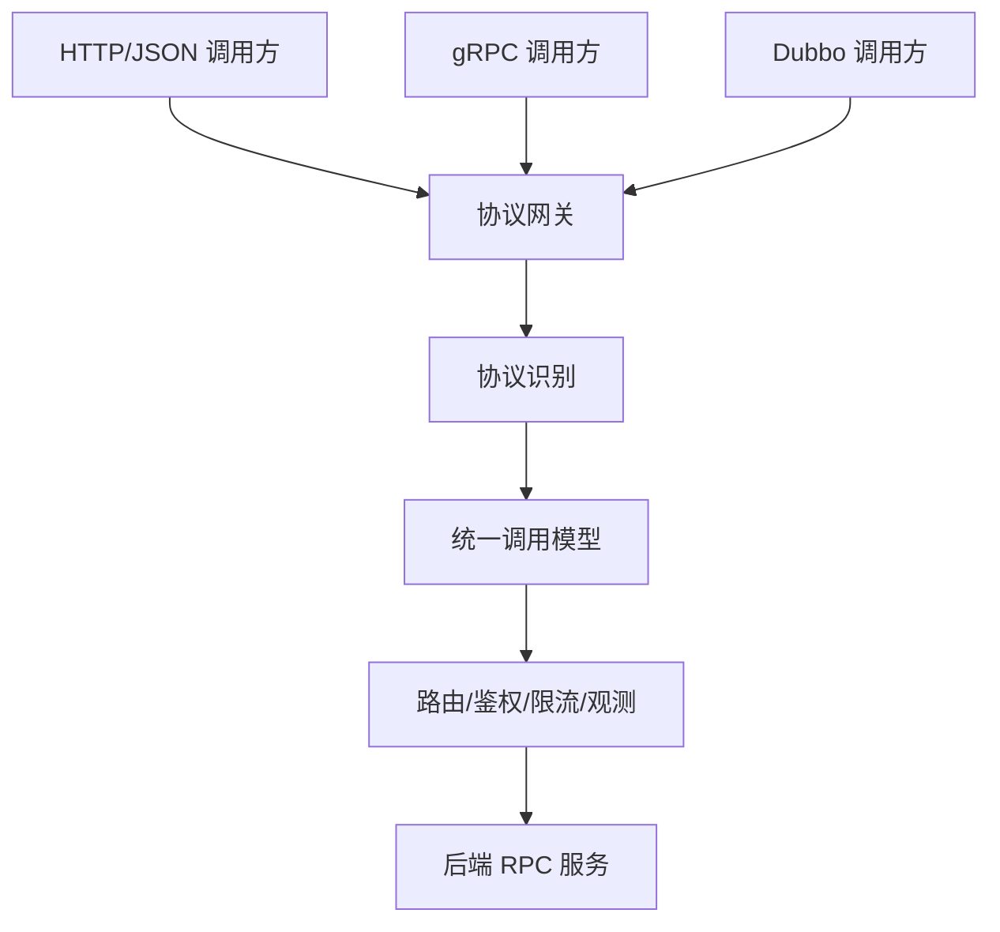
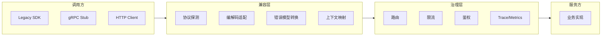
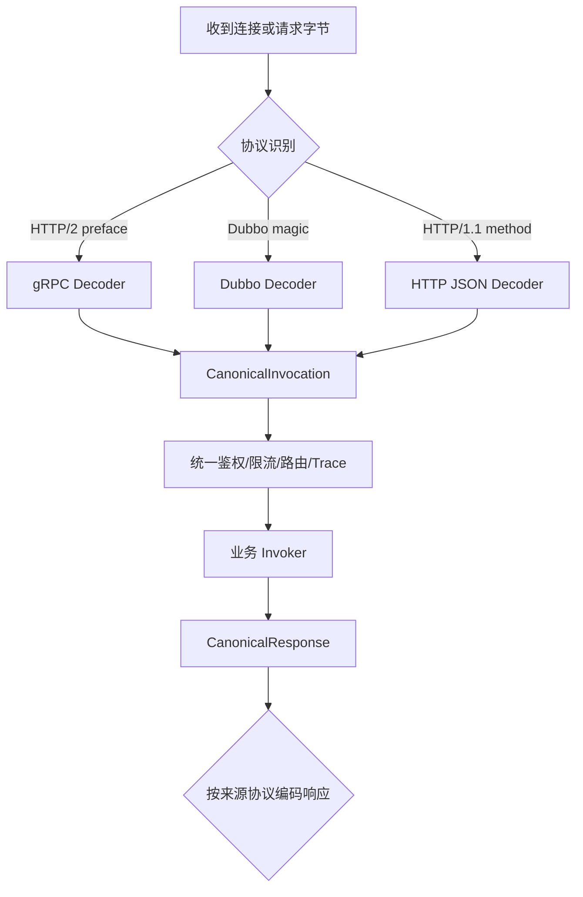

# 24 如何在线上环境里兼容多种 RPC 协议

线上系统很少从一开始就统一而干净。一个公司可能同时存在 Dubbo、gRPC、HTTP、Thrift、自研 TCP 协议；一个服务也可能因为升级、跨语言、历史包袱而同时暴露多种入口。多协议兼容的目标不是炫技，而是在不中断业务的前提下完成系统演进。

## 本章要解决的问题

本章关注：

- 为什么线上环境会出现多种 RPC 协议并存。
- 多协议兼容可以放在哪些层实现。
- 协议迁移如何分阶段推进。
- 多协议带来的性能、排障和治理复杂度如何控制。

## 核心观点

协议兼容要先明确“兼容什么”：传输层、协议头、序列化格式、服务发现、调用语义、错误模型、流式能力都可能不同。真正的难点不是把字节转成字节，而是让调用语义保持一致。

多协议兼容有四种常见位置：

- 客户端 SDK：调用方同时支持多协议。
- 服务端：同一服务监听多个端口或协议。
- 网关代理：统一入口做协议转换。
- Sidecar / Service Mesh：把协议适配下沉到基础设施。

## 原理拆解



统一调用模型通常包含：

- 服务：`serviceName`
- 方法：`methodName`
- 参数：`payload + schema`
- 上下文：`headers/attachments`
- 状态：`statusCode + errorType`
- 超时：`deadline`
- 返回：`response payload`

只要不同协议能映射到这一层，网关或框架就可以复用路由、限流、鉴权、日志和追踪能力。

## 工程实践

### 1. 协议迁移方案模板

以 Dubbo 迁移到 gRPC 为例，可以采用“双栈 + 灰度 + 回滚”的方案：

1. 盘点接口：方法、参数、异常、调用方、QPS、超时配置。
2. 定义 proto：保持字段语义稳定，补齐默认值和兼容规则。
3. 服务端双栈：旧 Dubbo 入口保留，新 gRPC 入口并行暴露。
4. 流量回放：用真实请求验证新协议响应一致性。
5. 客户端灰度：按调用方、分组或比例逐步切换。
6. 观测对齐：统一 traceId、错误码和指标标签。
7. 下线旧入口：确认无调用后关闭旧协议。

### 2. 多协议兼容架构



### 3. 兼容性检查表

- 协议是否支持请求响应、单向调用、流式调用等相同语义。
- 超时是相对时间还是绝对 deadline。
- 错误码是否能映射，是否会丢失异常细节。
- 上下文中的 trace、租户、灰度标签是否完整透传。
- 序列化默认值、空值、枚举未知值是否兼容。
- 长连接、连接池、压缩和 TLS 策略是否一致。
- 监控指标是否能按协议、服务、方法拆分。

### 4. 排障模板

```markdown
## 协议兼容问题
- 调用方协议：
- 服务方协议：
- 转换层位置：
- 失败方法：

## 现象
- 状态码：
- 异常类型：
- 是否可重现：
- 是否只影响某协议：

## 排查
- 协议识别：
- 编解码：
- 参数映射：
- 上下文透传：
- 错误转换：
- 超时语义：

## 结论
- 修复方案：
- 回滚方案：
- 兼容测试补充：
```

### 5. 补充图示：协议识别与统一模型转换



### 6. 代码示例：协议探测与适配入口

```java
public final class ProtocolDetectHandler {
    private final Map<Protocol, ProtocolAdapter> adapters;

    public void onRead(ByteBuf in, ChannelContext ctx) {
        Protocol protocol = detect(in);
        ProtocolAdapter adapter = adapters.get(protocol);
        if (adapter == null) {
            ctx.closeWithError("unsupported protocol: " + protocol);
            return;
        }

        CanonicalInvocation invocation = adapter.decode(in, ctx.headers());
        invocation.putAttribute("sourceProtocol", protocol.name());

        CanonicalResponse response = ctx.invoker().invoke(invocation);
        ByteBuf out = adapter.encode(response);
        ctx.write(out);
    }

    private Protocol detect(ByteBuf in) {
        if (startsWithHttp2Preface(in)) {
            return Protocol.GRPC;
        }
        if (in.readableBytes() >= 2 && in.getByte(0) == (byte) 0xDA && in.getByte(1) == (byte) 0xBB) {
            return Protocol.DUBBO;
        }
        if (startsWithAsciiMethod(in)) {
            return Protocol.HTTP_JSON;
        }
        return Protocol.UNKNOWN;
    }
}
```

这里的 `CanonicalInvocation` 是兼容层的关键抽象。只要不同协议都能转换到统一调用模型，治理能力就不用为每种协议重复实现。

## 常见坑

- 只做协议格式转换，忽略超时、错误码、重试语义差异。
- 多协议入口分别做鉴权和限流，规则不一致。
- trace 上下文映射不完整，跨协议后链路断裂。
- 双栈服务资源隔离不足，一个协议流量异常拖垮另一个协议。
- 迁移期过长，旧协议无人维护但仍承担线上流量。
- 没有记录协议维度指标，出问题时无法判断哪个入口异常。

## 面试追问

**问题 1：协议兼容放在客户端和网关各有什么优缺点？**  
客户端兼容性能损耗小、链路短，但升级成本高，需要所有调用方改 SDK。网关兼容对调用方透明，适合集中治理，但会增加一跳和转换成本。

**问题 2：HTTP/2 和 HTTP/1.1 对 RPC 有什么影响？**  
HTTP/2 支持多路复用、头部压缩和流式传输，更适合高并发 RPC；HTTP/1.1 在连接复用和并发请求上限制更多，但生态简单、调试方便。

**问题 3：为什么协议迁移必须保留回滚方案？**  
协议迁移涉及调用语义、序列化、治理和观测，一旦线上出现兼容问题，需要快速切回旧入口。没有回滚能力，迁移风险会被无限放大。

## 小结

多协议兼容是系统演进中的过渡能力，也是大型组织不可避免的现实。设计时要把协议差异收敛到统一调用模型，再复用治理和观测能力。迁移时要坚持双栈、灰度、回放、可回滚，避免把协议升级变成一次不可逆的线上冒险。
