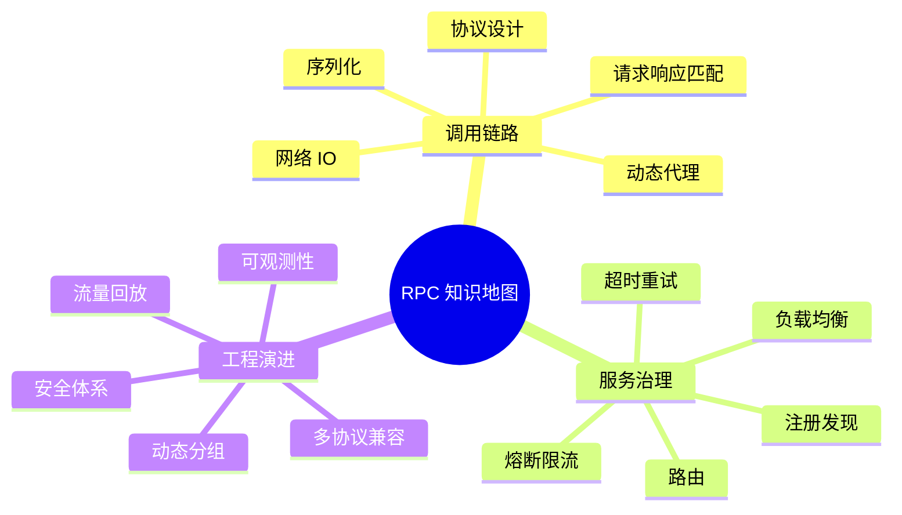
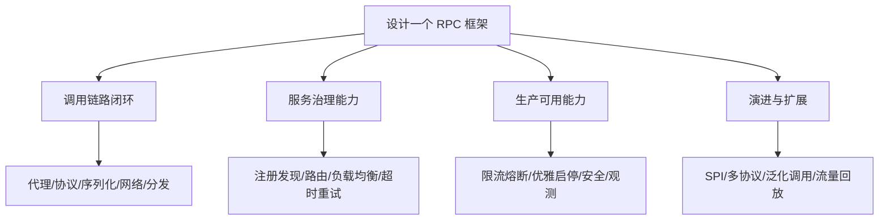

# 答疑课堂 基础篇与进阶篇思考题答案合集

这一篇把 RPC 系列中的高频思考题集中整理成问答。每个答案都尽量给出结论、原因、适用场景和反例，方便复习，也方便面试前快速建立知识地图。

## 本章要解决的问题

本章用于回答：

- RPC 基础概念中最容易混淆的问题。
- 协议、序列化、网络、代理、注册发现之间的关系。
- 超时、重试、限流、熔断、路由、负载均衡如何协作。
- 面试中如何把答案从“背概念”提升到“讲工程取舍”。

## 核心观点

RPC 的知识点很多，但可以归为三条主线：

- 调用链路：代理、协议、序列化、网络、服务分发。
- 服务治理：注册发现、路由、负载均衡、超时重试、熔断限流。
- 工程演进：观测、安全、回放、分组、泛化、多协议兼容。

只要回答问题时能落到这三条主线，就不会散。

## 原理拆解



## 工程实践：高频问答

### 1. RPC 和 HTTP 有什么区别？

HTTP 是应用层协议，RPC 是一种远程调用模型。RPC 可以基于 TCP、自定义协议、HTTP/2 或 HTTP/1.1 实现。两者不是同一维度。工程上，HTTP API 更偏资源和开放生态，RPC 更偏内部服务间高性能、强契约调用。

### 2. 为什么 RPC 要使用动态代理？

动态代理让业务代码面向接口编程，框架在代理层拦截方法调用，组装服务名、方法名、参数和上下文，再发起远程请求。它隐藏了网络细节，但不能消除远程调用的本质成本，所以仍要关注超时、重试和失败处理。

### 3. 协议设计最重要的字段是什么？

至少要包含魔数、版本、消息类型、序列化方式、请求 ID、消息体长度和状态码。魔数用于识别协议，版本用于兼容，请求 ID 用于响应匹配，长度用于解决 TCP 粘包半包，状态码用于表达框架层结果。

### 4. JSON 和 Protobuf 如何选择？

JSON 可读性好、调试方便、生态通用，但体积较大、性能一般、schema 约束弱。Protobuf 体积小、性能好、跨语言和向后兼容能力强，但需要 IDL 和代码生成。内部高性能、多语言服务更适合 Protobuf；开放接口或调试优先场景可以选择 JSON。

### 5. TCP 粘包半包是什么？

TCP 是字节流协议，不保证一次发送对应一次接收。接收方可能一次读到多条消息，也可能只读到半条消息。RPC 协议通常通过固定头 + bodyLength 解决消息边界问题。

### 6. 注册中心应该选 CP 还是 AP？

RPC 服务发现通常更偏 AP，因为短时间读到旧节点列表比完全不可用更可接受。但核心交易链路也要结合容灾策略、本地缓存、保护阈值和一致性要求。答案不是绝对 CP 或 AP，而是看故障时更愿意承受不可用还是短暂不一致。

### 7. 路由和负载均衡有什么区别？

路由先筛选“哪些节点可以用”，负载均衡再决定“这次请求用哪个节点”。例如灰度规则先筛出 `version=v2` 节点，然后负载均衡在这些节点中按权重或最少活跃选择一个。

### 8. 重试为什么危险？

重试会放大流量。如果下游已经慢了，调用方继续重试，可能把下游彻底打垮。安全重试需要总超时预算、重试次数限制、退避和抖动、幂等保护，并区分可重试异常和不可重试异常。

### 9. 限流、熔断、降级有什么区别？

限流控制进入系统的请求量；熔断在下游异常时快速失败，保护调用方资源；降级提供兜底结果或关闭非核心能力。限流面向入口容量，熔断面向依赖故障，降级面向业务连续性。

### 10. 优雅关闭为什么不能直接 kill 进程？

RPC 服务通常有长连接和正在执行的请求。直接 kill 会导致请求失败、客户端连接异常和注册中心状态滞后。优雅关闭需要先摘流，再拒绝新请求，等待存量请求完成，最后释放资源。

### 11. 异步 RPC 一定比同步 RPC 快吗？

不一定。异步 RPC 的优势是减少线程阻塞、提高资源利用率，尤其适合高并发等待型场景。它不会让单次网络传输变快，还会增加上下文传递、异常处理和回调编排复杂度。

### 12. 如何设计 RPC 安全体系？

要覆盖传输加密、服务身份认证、接口鉴权、防重放、敏感字段脱敏和审计。内网调用也不能默认可信，尤其在多团队、多集群和云原生环境中，要逐步引入零信任思路。

### 13. 补充图示：回答 RPC 设计题的结构



### 14. 代码示例：面试中可讲的最小 RPC 请求模型

```java
public record RpcRequest(
        String requestId,
        String serviceName,
        String methodName,
        List<String> parameterTypes,
        List<Object> arguments,
        Map<String, String> attachments,
        long deadlineMillis
) {}

public record RpcResponse(
        String requestId,
        int statusCode,
        Object value,
        String errorType,
        String errorMessage
) {}
```

围绕这两个模型可以自然展开很多问题：`requestId` 解决响应匹配，`attachments` 解决上下文透传，`deadlineMillis` 解决总超时预算，`statusCode` 和 `errorType` 解决框架异常与业务异常的区分。

## 常见坑

- 把 RPC 和某个具体框架画等号。
- 只回答概念，不说明适用场景和代价。
- 把重试当作提高成功率的万能手段。
- 忽略客户端治理，所有问题都归因到服务端。
- 认为注册中心挂了服务就一定不能调用，忽略本地缓存。
- 认为异步、HTTP/2、Protobuf 一定天然高性能。

## 面试追问

**问题 1：如何回答“设计一个 RPC 框架”？**  
先讲调用链路闭环：代理、请求模型、协议、序列化、网络、服务分发。再讲治理：注册发现、负载均衡、超时重试、熔断限流。最后讲生产能力：观测、安全、兼容、发布和扩展点。

**问题 2：如何回答“线上 RPC 超时怎么排查”？**  
先判断影响面，再看客户端和服务端指标，抽 trace 拆耗时，检查发布和配置变更，最后从线程池、连接池、网络、依赖资源、序列化和重试放大等维度确认原因。

**问题 3：如何回答“你读过 RPC 源码吗”？**  
不要说“看过很多类”。应该讲入口流程、核心抽象、扩展点和一次请求的生命周期。例如 Dubbo 可以讲代理、Invoker、Filter、Directory、Cluster、Protocol、ExchangeClient 等主线。

## 小结

RPC 面试和复习的关键，是把零散知识点放回调用链路和工程场景里。优秀答案通常不是最长的，而是能说清楚边界、取舍和生产风险。掌握这一点，RPC 就不再是一堆框架名词，而是一套分布式系统设计能力。
