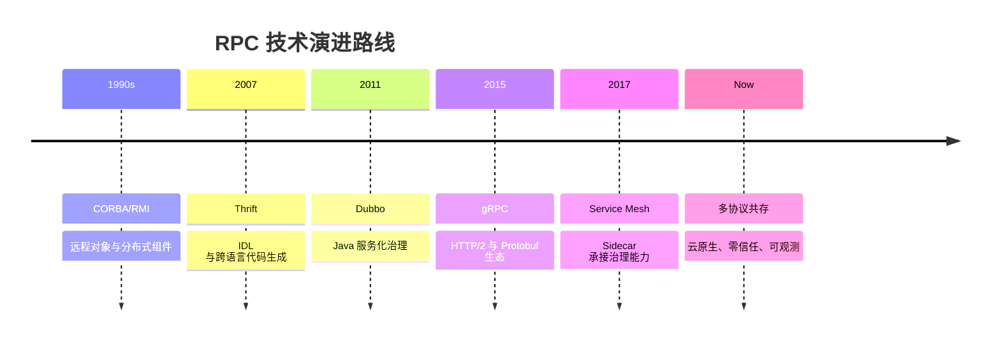
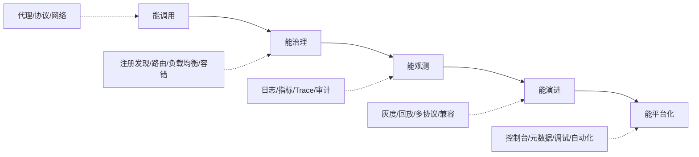

# 加餐 谈谈我所经历过的 RPC

RPC 的历史很像后端系统演进的缩影：一开始我们只想让两个进程互相调用，后来逐渐发现真正困难的是治理、观测、安全、兼容、组织协作和长期维护。框架从来不只是技术选择，它还反映了团队规模、语言生态、发布方式和稳定性要求。

## 本章要解决的问题

这一篇从工程复盘角度回答：

- RPC 技术为什么会不断演进。
- 不同阶段的 RPC 框架分别解决什么问题。
- 自研和开源框架如何取舍。
- 团队在 RPC 建设中容易踩哪些组织和工程坑。

## 核心观点

RPC 的演进主线不是“哪个框架更强”，而是“系统复杂度发生了什么变化”。单体拆服务时，RPC 解决调用问题；服务规模变大后，RPC 解决治理问题；多语言和云原生普及后，RPC 又要解决标准化、跨语言和基础设施下沉的问题。

可以粗略分为四个阶段：

| 阶段 | 主要诉求 | 典型技术 |
| --- | --- | --- |
| 远程对象 | 像调用本地对象一样调用远程对象 | RMI、CORBA |
| 高性能服务化 | 服务注册、长连接、二进制协议 | Thrift、Dubbo、自研 RPC |
| 跨语言标准化 | IDL、HTTP/2、流式调用 | gRPC、Protobuf |
| 基础设施治理 | 流量、安全、观测下沉 | API Gateway、Service Mesh、Envoy |

## 原理拆解



每一代方案都有自己的代价。RMI 使用方便但语言绑定强；Thrift 跨语言好但治理生态需要补；Dubbo 对 Java 服务化友好但跨语言不是天然优势；gRPC 标准化强但对浏览器、网关和传统治理体系需要适配；Service Mesh 降低业务侵入但引入基础设施复杂度。

## 工程实践

### 1. 自研还是开源

选择自研 RPC 前，至少要回答这些问题：

- 是否有强烈的业务特殊性，开源框架无法满足。
- 是否有长期维护团队，而不是靠一两个核心作者。
- 是否能持续跟进安全、观测、注册发现和云原生演进。
- 是否有迁移计划，避免把业务锁死在内部协议上。
- 是否能提供工具链：调试、压测、回放、治理台、文档。

如果只是为了“可控”，通常优先选择成熟开源框架并做扩展；如果公司已有巨大存量系统，自研框架也要尽量开放协议边界，避免成为技术债中心。

### 2. 技术选型 checklist

- 语言栈：单语言还是多语言。
- 性能目标：QPS、RT、payload 大小、连接规模。
- 治理需求：注册发现、路由、限流、熔断、灰度。
- 兼容要求：历史协议、旧 SDK、跨机房。
- 运维能力：监控、追踪、日志、配置中心。
- 团队能力：是否能排查网络、序列化和框架源码问题。
- 生态工具：网关、Mock、压测、接口管理、代码生成。

### 3. 系统演进复盘模板

```markdown
## 背景
- 业务规模：
- 服务数量：
- 语言栈：
- 当前痛点：

## 方案
- 框架选择：
- 协议选择：
- 注册发现：
- 治理能力：

## 迁移路径
- 双栈策略：
- 灰度范围：
- 回滚方式：
- 验证手段：

## 结果
- 性能变化：
- 稳定性变化：
- 研发效率变化：
- 遗留问题：
```

### 4. 补充图示：RPC 能力成熟度模型



### 5. 代码示例：RPC 技术选型评分表

```yaml
rpc_evaluation:
  candidate: grpc
  language_support:
    weight: 20
    score: 18
    note: "多语言生态成熟，IDL 标准化强"
  governance:
    weight: 25
    score: 16
    note: "基础调用强，复杂治理需要结合 xDS、网关或自研控制面"
  performance:
    weight: 20
    score: 17
    note: "HTTP/2 + Protobuf 表现稳定，需关注长连接和流控"
  observability:
    weight: 15
    score: 13
    note: "OpenTelemetry 支持较好，需统一指标标签"
  migration_cost:
    weight: 20
    score: 10
    note: "旧接口和调用方迁移成本较高，需要双栈灰度"
```

选型评分不是为了算出一个绝对分，而是迫使团队把“喜欢某个框架”转换成“哪些约束更重要”的讨论。

## 常见坑

- 把 RPC 框架当成性能工具，忽略治理和运维成本。
- 团队没有统一接口规范，服务越拆越乱。
- 自研协议没有文档，只有源码才是事实标准。
- SDK 升级缺少兼容策略，调用方长期停留在旧版本。
- 只关注服务端框架，忽略客户端超时、重试和连接池。
- 以为上了 Service Mesh 就不需要理解 RPC 基础。

## 面试追问

**问题 1：Dubbo 和 gRPC 如何选择？**  
如果主要是 Java 生态、服务治理诉求强、已有注册中心和配置中心，Dubbo 更贴近传统微服务治理。若多语言、IDL 标准化、HTTP/2 和流式调用更重要，gRPC 更合适。实际选择还要看团队生态和迁移成本。

**问题 2：为什么很多公司会长期多协议共存？**  
因为业务系统有存量，调用方升级周期长，不同团队语言栈不同，基础设施也在演进。强行统一协议成本很高，通常需要通过网关、双栈和灰度逐步收敛。

**问题 3：Service Mesh 会取代 RPC 框架吗？**  
不会完全取代。Mesh 可以下沉流量治理、安全和观测，但接口契约、序列化、客户端调用体验和业务语义仍需要 RPC 框架或 SDK 承担。

## 小结

RPC 的经验不是背诵框架名字，而是理解每次技术选择背后的系统约束。服务规模、语言生态、组织协作和稳定性要求会不断变化，框架也要随之演进。真正成熟的 RPC 建设，是让业务调用更简单，让故障定位更可靠，让系统升级更可控。
