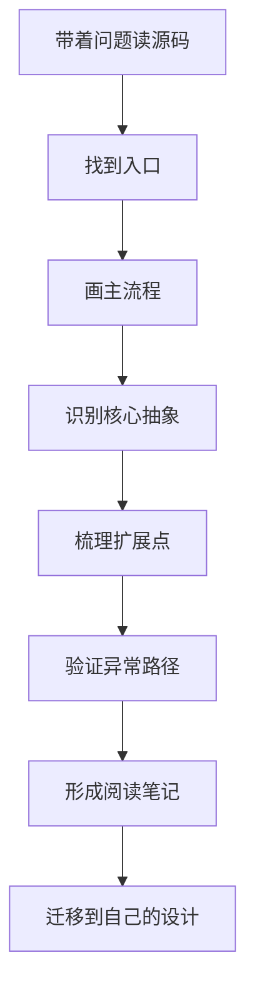
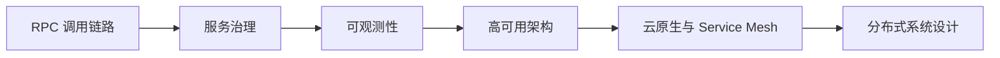

# 结束语 学会从优秀项目的源代码中挖掘知识

学完 RPC 原理之后，真正的进阶不是继续收集更多概念，而是去优秀项目的源码里验证这些概念如何落地。源码阅读的意义也不是把每一行代码都看懂，而是看懂设计边界、抽象关系、扩展点和工程取舍。

## 本章要解决的问题

这一篇作为系列收束，回答：

- 为什么读源码是 RPC 学习的重要阶段。
- 读源码时应该抓哪些主线，避免陷入细节。
- 如何把源码阅读沉淀成自己的设计能力。
- 后续如何继续学习分布式系统和服务治理。

## 核心观点

读源码要从问题出发，而不是从目录第一行开始。优秀项目之所以值得读，是因为它们在真实约束下做过大量取舍：性能和可维护性、灵活性和复杂度、兼容性和演进速度、用户体验和框架边界。读懂这些取舍，比背熟类名更重要。

建议始终围绕四个问题阅读：

- 主流程是什么：一次请求如何从入口走到出口。
- 核心抽象是什么：哪些接口稳定承载扩展能力。
- 变化点在哪里：序列化、协议、负载均衡、注册中心如何替换。
- 代价是什么：这个设计带来了哪些复杂度和限制。

## 原理拆解



可以优先阅读这些项目：

| 项目 | 阅读重点 |
| --- | --- |
| gRPC | Stub、Channel、Interceptor、NameResolver、LoadBalancer、HTTP/2 |
| Dubbo | Proxy、Invoker、Filter、Protocol、Registry、Cluster、SPI |
| Netty | EventLoop、ChannelPipeline、ByteBuf、Reactor 模型 |
| brpc | 高性能 C++ RPC、bthread、负载均衡、服务治理 |
| Envoy | xDS、Filter Chain、连接管理、多协议代理 |

## 工程实践

### 1. 源码阅读模板

```markdown
# 项目/模块名称

## 我带着什么问题读
- 

## 主流程
- 入口：
- 核心调用链：
- 出口：

## 核心抽象
- 抽象 1：
- 抽象 2：
- 抽象 3：

## 扩展点
- 如何扩展：
- 默认实现：
- 自定义代价：

## 异常路径
- 超时：
- 连接失败：
- 序列化失败：
- 服务端异常：

## 值得借鉴
- 

## 不适合照搬
- 
```

### 2. RPC 源码阅读路线

1. 先读官方文档和架构图，知道项目想解决什么问题。
2. 写一个最小 Demo，用断点跟一次成功调用。
3. 画出请求生命周期，不追逐所有旁支。
4. 第二轮专门看异常路径：超时、重试、连接失败、服务不可用。
5. 第三轮看扩展点：序列化、路由、负载均衡、过滤器。
6. 最后看性能优化：对象复用、线程模型、批处理、无锁或少锁设计。

### 3. 后续学习路线图



### 4. 实践 checklist

- 每读一个模块，都画一张自己的流程图。
- 每遇到一个接口，记录它稳定的职责和变化的实现。
- 每看一个优化，问清楚它解决的瓶颈是什么。
- 每看一个异常处理，思考如果没有它线上会发生什么。
- 把源码笔记和自己的项目经验关联起来。
- 不照搬成熟框架设计，先确认自己的场景是否有同样约束。

## 常见坑

- 从入口目录开始逐文件阅读，很快迷路。
- 只看正常路径，不看超时、失败、取消和关闭。
- 只记类名，不理解抽象背后的边界。
- 看到复杂设计就想搬进自己的项目，忽略团队维护成本。
- 读源码没有输出，过一段时间只剩“我好像看过”。
- 把源码当标准答案，忘了它也是在特定历史条件下演进出来的。

## 面试追问

**问题 1：如何证明你真的读过一个 RPC 框架源码？**  
能讲清一次请求的生命周期、关键抽象、扩展点、异常路径和你从中学到的设计取舍。只说“看过某某类”通常不够。

**问题 2：源码阅读如何转化为工程能力？**  
把源码中的设计还原成问题和约束，再判断自己的项目是否有相同约束。能迁移思想，而不是复制代码，才算真正吸收。

**问题 3：为什么优秀项目也不能盲目照搬？**  
成熟框架面对的是通用场景和历史兼容，设计会更复杂。业务项目如果没有同等规模和扩展诉求，照搬会带来过度设计和维护负担。

## 小结

RPC 系列的终点不是“知道框架怎么用”，而是能理解远程调用背后的系统设计：协议如何演进，流量如何治理，故障如何定位，架构如何迁移。继续读优秀源码时，请带着问题、画出主线、记录取舍。你最终收获的不会只是 RPC 知识，而是一种面对复杂系统时不慌不乱的工程判断力。
